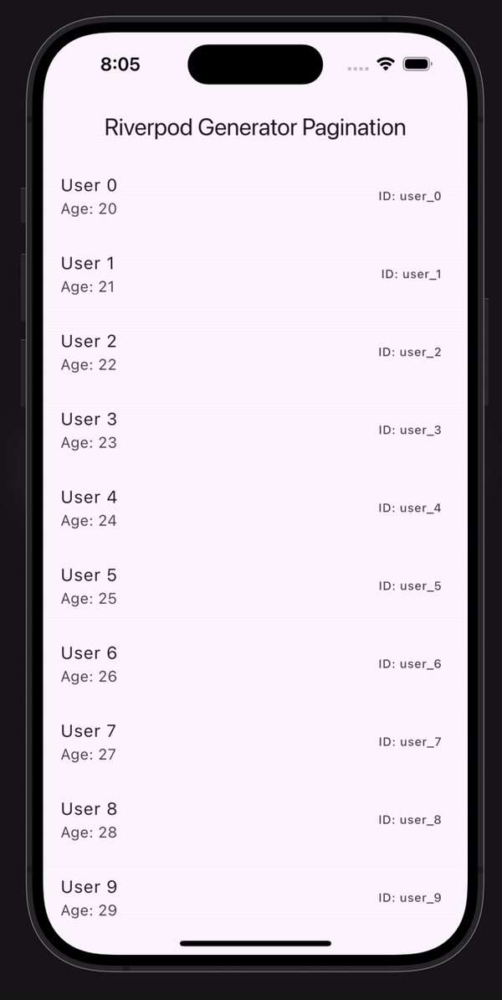

<!DOCTYPE html>
<html lang="en">
<head>
  <meta charset="UTF-8">
  <meta name="viewport" content="width=device-width, initial-scale=1.0">
 
</head>
<body>

  <h1>Riverpod Generator Pagination with Hooks in Flutter</h1>
  
  
This Flutter project demonstrates infinite scroll pagination using <strong>Riverpod</strong>, <strong>Riverpod Generator</strong>, and <strong>Flutter Hooks</strong>.

  

  

  <h2>Features</h2>
  <ul>
    <li>Infinite scrolling with pagination</li>
    <li>State management using Riverpod and Riverpod Generator</li>
    <li>Simple loading and error handling</li>
  </ul>

  <h2>Setup</h2>
  <ol>
    <li>Clone the repository:
      <pre><code>git clone https://github.com/your-username/your-repo.git</code></pre>
    </li>
    <li>Install dependencies:
      <pre><code>flutter pub get</code></pre>
    </li>
    <li>Run the app:
      <pre><code>flutter run</code></pre>
    </li>
  </ol>

  <h2>Overview</h2>
  <ul>
    <li><strong>UserListView</strong>: UI that displays a paginated list of users.</li>
    <li><strong>UserListNotifier</strong>: Handles state and pagination logic.</li>
    <li><strong>UsersRepository</strong>: Simulates data fetching.</li>
  </ul>

  <h2>Customization</h2>
  <ul>
    <li>Replace <code>UsersRepository</code> with real API logic as needed.</li>
    <li>Modify the UI in <code>UserListView</code> to fit your design.</li>
  </ul>

</body>
</html>
